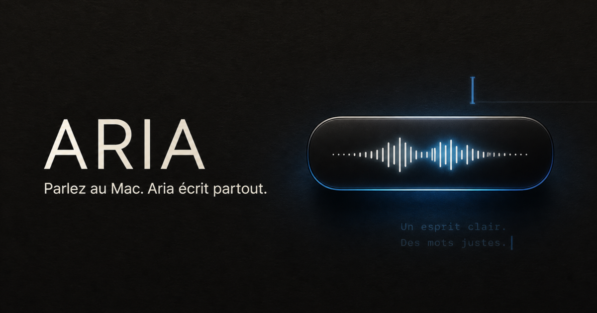

# Aria pour macOS

**Parlez. Le texte s’écrit dans l’app où vous êtes.**

[Page officielle](https://hfioafio.github.io/Aria-Downloads/) · [English](https://hfioafio.github.io/Aria-Downloads/en.html) · [Dernière release](https://github.com/hfioafio/Aria-Downloads/releases/latest)

  

Aria reste dans la barre des menus. Un raccourci, votre voix, et la phrase arrive dans Mail, Messages, Notes ou n’importe quel champ — pas dans une fenêtre à part à recopier.

Le moteur local (Parakeet) garde l’audio et la transcription sur le Mac. Les moteurs cloud sont optionnels et utilisent **votre** clé. La version gratuite donne 2 000 mots par semaine. Aria Pro coûte 5 € une seule fois, pour trois Mac, sans abonnement.

## Télécharger — bêta 2.51.1

| Mac | Fichier |
| --- | --- |
| Apple Silicon (M1, M2, M3, M4 et suivants) | [Aria-2.51.1-Apple-Silicon.dmg](https://github.com/hfioafio/Aria-Downloads/releases/download/v2.51.1/Aria-2.51.1-Apple-Silicon.dmg) |
| Intel | [Aria-2.51.1-Intel.dmg](https://github.com/hfioafio/Aria-Downloads/releases/download/v2.51.1/Aria-2.51.1-Intel.dmg) |

Empreintes : [SHA-256 Apple Silicon](https://github.com/hfioafio/Aria-Downloads/releases/download/v2.51.1/Aria-2.51.1-Apple-Silicon.dmg.sha256) · [SHA-256 Intel](https://github.com/hfioafio/Aria-Downloads/releases/download/v2.51.1/Aria-2.51.1-Intel.dmg.sha256)

Ne mélangez pas les deux : le fichier Apple Silicon n’est pas fait pour Rosetta.

## Première ouverture

Cette bêta est signée avec une identité Apple stable, mais **pas encore notarisée**. Après avoir glissé Aria dans Applications :

1. Essayez de l’ouvrir une fois.
2. Si macOS la bloque : **Réglages Système → Confidentialité et sécurité → Ouvrir quand même**.

Ne faites cette étape que pour un fichier venu de **ce dépôt**. Les mises à jour suivantes conservent Micro, Accessibilité et Trousseau.

## Mises à jour

Aria consulte ce dépôt au démarrage, puis toutes les six heures. Avant d’installer, elle vérifie l’architecture, la taille, le SHA-256 et l’identité Apple. Si la nouvelle version ne démarre pas, l’ancienne est restaurée.

## English

Speak. Aria types into Mail, Messages, Notes, or whatever app has the cursor.

- [Apple Silicon DMG](https://github.com/hfioafio/Aria-Downloads/releases/download/v2.51.1/Aria-2.51.1-Apple-Silicon.dmg)
- [Intel DMG](https://github.com/hfioafio/Aria-Downloads/releases/download/v2.51.1/Aria-2.51.1-Intel.dmg)
- [English page](https://hfioafio.github.io/Aria-Downloads/en.html)

Local engine available. Cloud engines use your own API key. Public beta is signed but not notarized yet: first launch may need **System Settings → Privacy & Security → Open Anyway**.

## Confidentialité

Les clés API restent dans le Trousseau macOS. Les données de l’application restent sur le Mac. Avec un modèle local, aucun audio n’est envoyé à un fournisseur de transcription. Avec un modèle API, seul l’audio à transcrire part vers le fournisseur que vous avez choisi.

Cette page et ce dépôt ne portent pas de publicité ni de traceur tiers.

## Aide

Ouvrez une [issue](https://github.com/hfioafio/Aria-Downloads/issues/new). N’y collez pas de clé API, de dictée, ni d’autre donnée personnelle.

## Ce dépôt

Il contient uniquement les versions compilées, leurs empreintes SHA-256 et le manifeste de mise à jour. Le code source n’y est pas publié.

Copyright © 2026 — Tous droits réservés.
