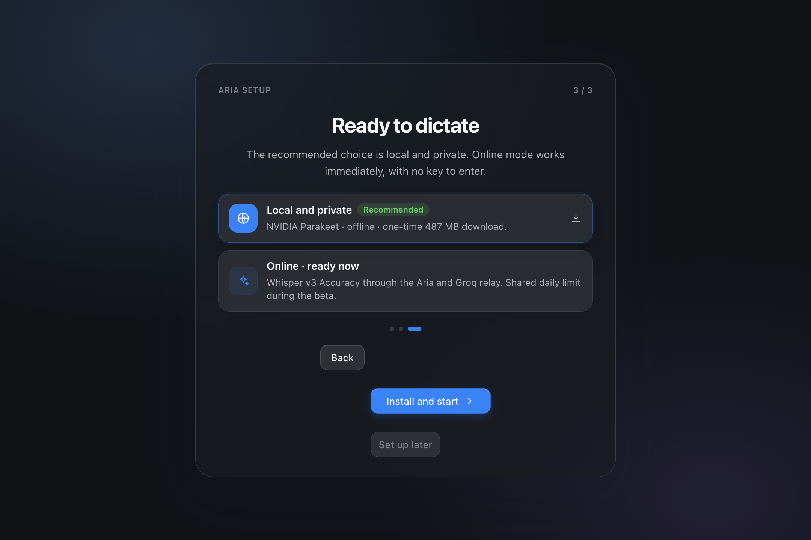

# Aria pour macOS

**Parlez. Le texte s’écrit dans l’app où vous êtes.**

[Page](https://hfioafio.github.io/Aria-Downloads/) · [English](https://hfioafio.github.io/Aria-Downloads/en.html) · [v2.60.2-preview.86](https://github.com/hfioafio/Aria-Downloads/releases/tag/v2.60.2-preview.86)

Aria reste dans la barre des menus. Un raccourci, votre voix, et la phrase arrive dans Mail, Messages, Notes ou n’importe quel champ — pas dans une fenêtre à part à recopier.

La version publique actuelle est une app **Electron** pour macOS 11+. Ce n’est pas une app Swift.

Le mode local garde l’audio et la transcription sur le Mac. Pendant la bêta, le mode Groq fonctionne aussi sans clé à saisir grâce à un relais Aria limité ; ni l’audio ni le texte ne sont conservés par ce relais. Gratuit : 2 000 mots par semaine. Aria Pro : 5 € une fois, trois Mac, pas d’abonnement.

## Télécharger — bêta 2.60.2-preview.86

| Mac | Fichier |
| --- | --- |
| Apple Silicon (M1, M2, M3, M4 et suivants) | [Aria-2.60.2-preview.86-Apple-Silicon.dmg](https://github.com/hfioafio/Aria-Downloads/releases/download/v2.60.2-preview.86/Aria-2.60.2-preview.86-Apple-Silicon.dmg) |
| Intel | [Aria-2.60.2-preview.86-Intel.dmg](https://github.com/hfioafio/Aria-Downloads/releases/download/v2.60.2-preview.86/Aria-2.60.2-preview.86-Intel.dmg) |

Empreintes : [SHA-256 Apple Silicon](https://github.com/hfioafio/Aria-Downloads/releases/download/v2.60.2-preview.86/Aria-2.60.2-preview.86-Apple-Silicon.dmg.sha256) · [SHA-256 Intel](https://github.com/hfioafio/Aria-Downloads/releases/download/v2.60.2-preview.86/Aria-2.60.2-preview.86-Intel.dmg.sha256)

Ne mélangez pas les deux : le fichier Apple Silicon n’est pas fait pour Rosetta.

## Première ouverture

Cette bêta possède une identité de signature stable, mais **n’est pas encore notarisée par Apple**. Après avoir glissé Aria dans Applications :

1. Essayez de l’ouvrir une fois.
2. Si macOS la bloque : **Réglages Système → Confidentialité et sécurité → Ouvrir quand même**.

Ne faites cette étape que pour un fichier venu de **ce dépôt**. Les mises à jour suivantes conservent Micro, Accessibilité et Trousseau.

## Mises à jour

Aria consulte ce dépôt au démarrage, puis toutes les six heures. Avant d’installer, elle vérifie l’architecture, la taille, le SHA-256 et l’identité Apple. Si la nouvelle version ne démarre pas, l’ancienne est restaurée.

## English

Speak. Aria types into Mail, Messages, Notes, or whatever app has the cursor.

Current public build is **Electron**, not Swift.

- [Apple Silicon DMG](https://github.com/hfioafio/Aria-Downloads/releases/download/v2.60.2-preview.86/Aria-2.60.2-preview.86-Apple-Silicon.dmg)
- [Intel DMG](https://github.com/hfioafio/Aria-Downloads/releases/download/v2.60.2-preview.86/Aria-2.60.2-preview.86-Intel.dmg)
- [English page](https://hfioafio.github.io/Aria-Downloads/en.html)

Local mode keeps audio and text on the Mac. During the beta, Groq online mode also works without entering a key through a limited Aria relay; the relay stores neither audio nor transcripts. The public beta is signed but not notarized yet: first launch may need **System Settings → Privacy & Security → Open Anyway**.

## Confidentialité

Les clés API personnelles restent dans le Trousseau macOS. Les données de l’application restent sur le Mac. Avec un modèle local, aucun audio n’est envoyé. Avec le mode Groq fourni pendant la bêta, l’audio passe par le relais Aria vers Groq puis est immédiatement abandonné ; le relais ne stocke ni l’audio ni le texte. Des compteurs pseudonymes et bornés protègent seulement le quota partagé.

Cette page et ce dépôt ne portent pas de publicité ni de traceur tiers.

## Aide

Ouvrez une [issue](https://github.com/hfioafio/Aria-Downloads/issues/new). N’y collez pas de clé API, de dictée, ni d’autre donnée personnelle.

## Ce dépôt

Il contient uniquement les versions compilées, leurs empreintes SHA-256 et le manifeste de mise à jour. Le code source n’y est pas publié.

Copyright © 2026 — Tous droits réservés.
